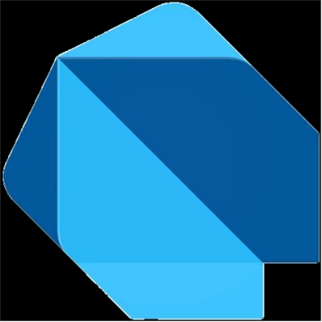
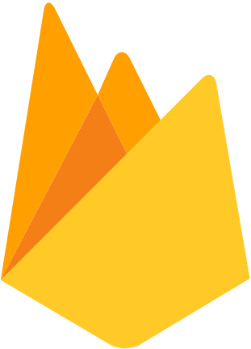
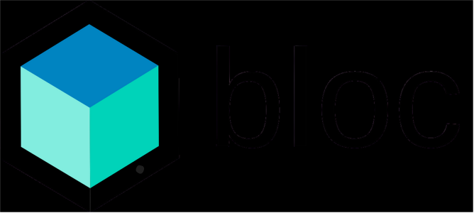
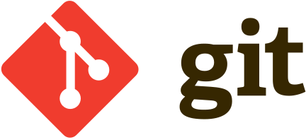
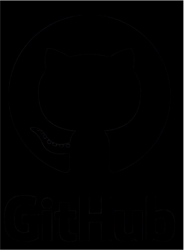
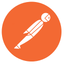
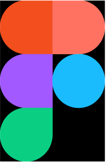
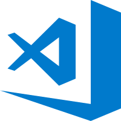

<h1 align="center">
  
</h1>

<h5 align="center">
  <code><a href="https://www.linkedin.com/in/abdulrhman-mohamed-080238251/" title="LinkedIn Profile"> LinkedIn</a></code>
  <code><a href="https://drkomy.com" title="drKomy Team"> drKomy</a></code>
  <code><a href="mailto:abdulrhman.mohamed.it@gmail.com"> Email</a></code>
</h5>

 

  👋 I'm <strong>Abdulrhman Mohamed</strong>, a passionate <strong>Flutter Developer</strong> with 2.5+ years of experience building scalable and elegant cross-platform applications. 
  💼 Founder of <a href="https://drkomy.com">drKomy for Software Solutions</a> — turning innovative ideas into real digital products. 
  🎓 BSc in Software Engineering (IT Department) 
  🚀 Always eager to learn new technologies and deliver impactful solutions.

---

## 🔧 Tech Stack & Tools

  <code></code>
  <code></code>
  <code></code>
  <code></code>
  <code></code>
  <code></code>
  <code></code>
  <code></code>
  <code></code>
  <code></code>
  <code></code>

---

## 📈 GitHub Stats

  
  

  

  

---

## 🚀 Highlighted Projects

  
  

     

  
  

     

  
  

     

<h4 align="center">
  <a href="https://github.com/AbdulrhmanM0hamed?tab=repositories" title="Show More Repos">🔎 Show More 🔍</a>
</h4>

---

<!--
  🔭 I’m currently working on ...
  🌱 I’m currently learning ...
  👯 I’m looking to collaborate on ...
  🤔 I’m looking for help with ...
  💬 Ask me about ...
  📫 How to reach me: ...
  ⚡ Fun fact: ...
-->
