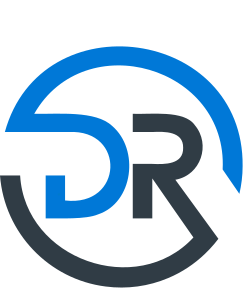

<!DOCTYPE html>
<html lang="ar" dir="ltr">
<head>
  <meta charset="UTF-8" />
  <meta name="viewport" content="width=device-width, initial-scale=1.0"/>
  <title>Abdulrhman Mohamed | Profile README</title>
  
</head>
<body>

  
    
  
  <!-- Typing SVG header -->
  

    
    <h1 class="hero-title">Abdulrhman Mohamed</h1>
    
👋 Passionate <b>Flutter Developer</b> with 2.5+ years experience building scalable, elegant cross-platform apps. 
      💼 Founder of <a style="color:#4dd6a1;font-weight:700;text-decoration:none;" href="https://drkomy.com">drKomy Software Solutions</a> — turning ideas into real products. 
      🎓 BSc in Software Engineering · 🚀 Eager to learn &amp; deliver impactful solutions.
    

  

  
  

    <a href="https://www.linkedin.com/in/abdulrhman-mohamed-080238251/" title="LinkedIn Profile">
       LinkedIn
    </a>
    <a href="https://drkomy.com" title="drKomy Team">
       drKomy
    </a>
    <a href="mailto:abdulrhman.mohamed.it@gmail.com" title="Email">
       Email
    </a>
  

  

  <!-- Tech Stack Card -->
  

    <h2>🛠️ Tech Stack &amp; Tools</h2>
    

      
      
      
      
      
      
      
      
      
      
      
      
      
      
      
    

  

  
📈 GitHub Stats

  

    
    
  

  

    
  

  

    
  

  

  
🚀 Highlighted Projects

  

    
    
    
    
  

  <a href="https://github.com/AbdulrhmanM0hamed?tab=repositories" title="Show More Repos">
    <button class="more-btn">🔎 Show More 🔍</button>
  </a>

</body>
</html>

